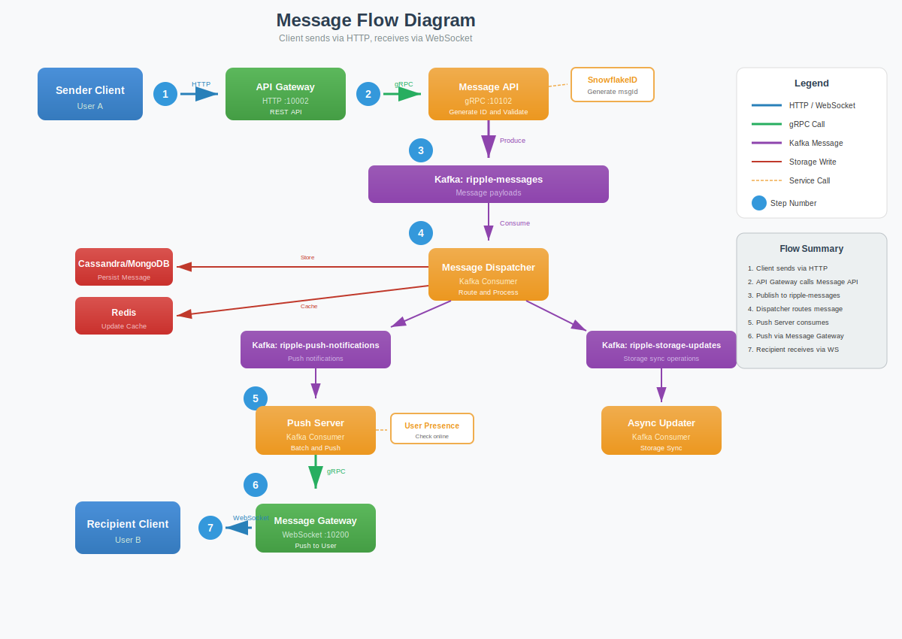

# Ripple-IM

A high-performance, scalable instant messaging system built with microservices architecture.

## Why Ripple-IM?

Building a reliable instant messaging system involves solving several complex distributed systems challenges:

- **Real-time Delivery**: Messages must be delivered instantly across distributed servers while maintaining order and
  consistency
- **Scalability**: The system must handle millions of concurrent connections and messages without degradation
- **Reliability**: No message should be lost, even during server failures or network partitions
- **Presence Management**: Tracking user online status across multiple devices and gateway instances
- **Horizontal Scaling**: Each component should scale independently based on load

Ripple-IM addresses these challenges through:

| Challenge           | Solution                                                                          |
|---------------------|-----------------------------------------------------------------------------------|
| Real-time delivery  | WebSocket connections with Netty for low-latency push                             |
| Message reliability | Kafka message queue ensures at-least-once delivery                                |
| Data consistency    | **Cassandra or MongoDB** for write-heavy message storage with tunable consistency |
| Service discovery   | ZooKeeper for dynamic gateway instance registration                               |
| Horizontal scaling  | Stateless microservices with gRPC for efficient inter-service communication       |
| ID generation       | Snowflake algorithm for globally unique, time-ordered message IDs                 |

## Features

- **Real-time Messaging**: WebSocket-based real-time communication with low latency
- **Direct & Group Chat**: Support for one-on-one and group conversations
- **OAuth2 Authentication**: Secure authentication with JWT tokens and Google OAuth2 support
- **Scalable Architecture**: Microservices design with gRPC inter-service communication
- **Message Persistence**: Reliable message storage with **Cassandra or MongoDB**
- **High Availability**: Kafka-based message queuing for reliable delivery
- **User Presence**: Real-time online status tracking
- **File Upload**: Avatar and attachment support with MinIO object storage
- **Distributed ID Generation**: Snowflake algorithm for globally unique IDs

## Client Application

The demo desktop client for Ripple-IM is available at: [ripple-im-app](https://github.com/fanaujie/ripple-im-app)

## Architecture Overview


Ripple-IM follows a microservices architecture pattern with the following layers:

- **Gateway Layer**: API Gateway, Message Gateway, Upload Gateway
- **Core Services Layer**: Message processing, dispatching, and push notifications
- **Infrastructure Layer**: Databases, caches, message queues, and service discovery

## Message Flow



1. Client sends message via HTTP POST to API Gateway
2. API Gateway forwards request to Message API Server (gRPC)
3. Message API generates Snowflake ID and publishes to Kafka
4. Message Dispatcher consumes, persists to **Cassandra or MongoDB**, and updates Redis cache
5. Push notification published to Kafka
6. Push Server queries user online status and delivers via Message Gateway (gRPC)
7. Message Gateway pushes to recipient via WebSocket
8. Recipient client receives message through WebSocket connection

## Modules

| Module                           | Description                                                       | Port          | Protocol  |
|----------------------------------|-------------------------------------------------------------------|---------------|-----------|
| **ripple-api-gateway**           | REST API entry point for user, conversation, and group management | 10002         | HTTP      |
| **ripple-authorization-server**  | OAuth2 authentication and JWT token management                    | 10001         | HTTP      |
| **ripple-message-gateway**       | WebSocket server for real-time communication                      | 10200 / 10103 | WS / gRPC |
| **ripple-message-api-server**    | Core message processing and routing logic                         | 10102         | gRPC      |
| **ripple-message-dispatcher**    | Kafka consumer for message routing and persistence                | -             | Kafka     |
| **ripple-push-server**           | Push notification service for online users                        | -             | Kafka     |
| **ripple-upload-gateway**        | File upload service with MinIO integration                        | 10003         | HTTP      |
| **ripple-user-presence-server**  | User online status management                                     | 10101         | gRPC      |
| **ripple-snowflakeid-server**    | Distributed unique ID generation                                  | 10100         | Netty     |
| **ripple-async-storage-updater** | Kafka consumer for async storage synchronization                  | -             | Kafka     |
| **ripple-storage**               | Data persistence layer (**Cassandra or MongoDB**)                 | -             | Library   |
| **ripple-cache**                 | Redis caching layer                                               | -             | Library   |
| **ripple-communication**         | gRPC and Kafka communication utilities                            | -             | Library   |
| **ripple-protobuf**              | Protocol Buffer message definitions                               | -             | Library   |

## Technology Stack

### Core

| Category  | Technology              |
|-----------|-------------------------|
| Language  | Java                    |
| Framework | Spring Boot             |
| Security  | Spring Security, OAuth2 |

### Communication

| Category      | Technology       |
|---------------|------------------|
| RPC           | gRPC             |
| Serialization | Protocol Buffers |
| Message Queue | Apache Kafka     |
| Network       | Netty            |

### Storage

| Category       | Technology                                    |
|----------------|-----------------------------------------------|
| Main Database  | **Apache Cassandra** (Default) or **MongoDB** |
| Auth Database  | MySQL                                         |
| Cache          | Redis                                         |
| Object Storage | MinIO                                         |

### Service Discovery

| Technology       |
|------------------|
| Apache ZooKeeper |

## Prerequisites

- **Java 17** or higher
- **Maven 3.6+**
- **Docker & Docker Compose** (for infrastructure services)
- **Memory**: At least **16GB RAM** is recommended for full stack deployment.

## Getting Started

### ⚠️ Resource Warning

Running the full stack (10+ services + infrastructure) via **Docker Compose** or **Minikube** is resource-intensive and
requires significant memory.

**For local development and testing on machines with limited RAM, we strongly
recommend [Option 3: Manual JAR Execution](#option-3-manual-jar-execution)**. This method is much more memory-efficient
as it runs services directly as JVM processes.

### 📦 Storage Backend Selection

Ripple-IM supports both **Apache Cassandra** and **MongoDB** as the message storage backend. The choice is made at *
*build time** using Maven profiles.

- **Cassandra** (Default): High write throughput, suitable for massive scale.
- **MongoDB**: Flexible document model, easier to manage for smaller deployments.

**To switch to MongoDB:**
You must build the project with the `mongodb` profile (e.g., `mvn clean install -Pmongodb`).

### Prerequisites

**Configure Google OAuth** (Required for Authorization Server):

> **Warning**: The default client-id and client-secret in the code are placeholders and **will not work**. You must
> replace them with your own valid Google OAuth credentials.

### Option 1: Local Development with Docker Compose

The project uses split Docker Compose files for flexibility:

| File                                 | Contents                                                                  | Use Case           |
|--------------------------------------|---------------------------------------------------------------------------|--------------------|
| `deploy/docker-compose.infra.yml`    | Infrastructure (MySQL, Cassandra/Mongodb, Redis, Kafka, Zookeeper, MinIO) | Always needed      |
| `deploy/docker-compose.services.yml` | All 10 application services                                               | Full stack testing |

> **Note**: Running both files together requires substantial memory.

#### Start Infrastructure Only (for IDE debugging)

```bash
# Start infrastructure services (runs BOTH Cassandra and MongoDB containers)
docker compose -f deploy/docker-compose.infra.yml up -d
```

#### Start Full Stack

```bash
# Start everything
docker compose -f deploy/docker-compose.infra.yml -f deploy/docker-compose.services.yml up -d
```

### Option 2: Kubernetes Deployment (Minikube)

For production or staging environments, deploy to Kubernetes with external managed infrastructure.

See [Deployment Guide](deploy/README.md) for detailed instructions.

**Quick Start:**

```bash
./deploy/01-start-infra.sh
./deploy/02-connect-minikube.sh
./deploy/03a-build-images.sh [mongodb] # Optional 'mongodb' profile
./deploy/04-deploy.sh
```

### Option 3: Manual JAR Execution (Recommended for Testing)

This is the **most memory-efficient** way to run Ripple-IM on a single machine.

#### 1. Build the Project

```bash
# Build for Cassandra (Default)
mvn clean install -DskipTests

# OR Build for MongoDB
mvn clean install -DskipTests -Pmongodb
```

#### 2. Start Infrastructure

Ensure the infrastructure services are running first:

```bash
docker compose -f deploy/docker-compose.infra.yml up -d
```

#### 3. Start Application Services

```bash
# Start all 10 services in correct order
./start-services.sh
```

The script will:

- Detect the required configuration based on the built JARs
- Save PIDs to `pids/` and logs to `logs/`
- Run as lightweight background processes

#### 4. Manage Services

```bash
# View logs
tail -f logs/ripple-api-gateway.log

# Stop all services
./stop-services.sh
```

The script will:

- Start all 10 services in the correct dependency order
- Save PIDs to `pids/` directory for management
- Save logs to `logs/` directory

#### Stop Services

```bash
# Stop all services
./stop-services.sh
```

#### View Logs

```bash
# View logs for a specific service
tail -f logs/<service-name>.log

# Example: view API Gateway logs
tail -f logs/ripple-api-gateway.log
```

## Observability

The project includes OpenTelemetry instrumentation for metrics collection and Grafana dashboards.

### Components

| Component      | Port      | Description                       |
|----------------|-----------|-----------------------------------|
| OTel Collector | 4317/4318 | Receives OTLP metrics (gRPC/HTTP) |
| Prometheus     | 9090      | Metrics storage and querying      |
| Grafana        | 3000      | Dashboards and visualization      |

### Start with Monitoring

```bash
# Docker Compose (includes OTel Collector, Prometheus, Grafana)
docker compose -f deploy/docker-compose.infra.yml up -d

# Local JAR with OTel Agent
./start-services.sh --with-agent
```

### Dashboards

Access Grafana at http://localhost:3000 (anonymous access enabled):

- **Ripple Service Metrics (OTel)**: JVM, HTTP, gRPC, Kafka metrics for all services
- **Ripple Snowflake ID Server**: ID generation rate and latency metrics

## API Documentation

After starting the gateway services, you can access the interactive Swagger UI documentation:

| Service        | Swagger UI URL                         |
|----------------|----------------------------------------|
| API Gateway    | http://localhost:10002/swagger-ui.html |
| Upload Gateway | http://localhost:10003/swagger-ui.html |

## WebSocket Protocol

### Connection

```
ws://localhost:10200/ws
Headers:
  Authorization: Bearer <JWT_TOKEN>
  X-Device-Id: <DEVICE_ID>
```

### Message Format (Protocol Buffers)

```protobuf
// Main WebSocket message wrapper
message WsMessage {
  oneof message_type {
    HeartbeatRequest heartbeat_request = 1;
    HeartbeatResponse heartbeat_response = 2;
    PushMessageRequest push_message_request = 3;
  }
}

// Client → Server: Heartbeat to maintain connection
message HeartbeatRequest {
  string user_id = 1;
  int64 timestamp = 2;
}

// Server → Client: Heartbeat acknowledgment
message HeartbeatResponse {
  string user_id = 1;
  int64 client_timestamp = 2;
  int64 server_timestamp = 3;
}

// Server → Client: Push message or event notification
message PushMessageRequest {
  string send_user_id = 1;
  string receive_user_id = 2;
  string receive_device_id = 3;
  oneof payload {
    PushEventPayload event_payload = 4;
    PushMessagePayload message_payload = 5;
  }
}

message PushMessagePayload {
  PushMessageType message_type = 1;  // SINGLE or GROUP
  SendMessageReq message_data = 2;
  int32 unread_count = 3;
}

message SendMessageReq {
  int64 sender_id = 1;
  string conversation_id = 2;
  int64 receiver_id = 3;
  int64 group_id = 4;
  int64 message_id = 5;
  int64 send_timestamp = 6;
  oneof message {
    SingleMessageContent single_message_content = 7;
    GroupCommandMessageContent group_command_message_content = 8;
  }
}

message SingleMessageContent {
  string text = 2;
  string file_url = 3;
  string file_name = 4;
}
```

## Database Schema

| Database  | Schema File                                                                                                              |
|-----------|--------------------------------------------------------------------------------------------------------------------------|
| Cassandra | [cassandra-ddl/ripple.cql](cassandra-ddl/ripple.cql)                                                                     |
| MySQL     | [ripple-authorization-server/.../V1__init.sql](ripple-authorization-server/src/main/resources/db/migration/V1__init.sql) |

## License

MIT License
